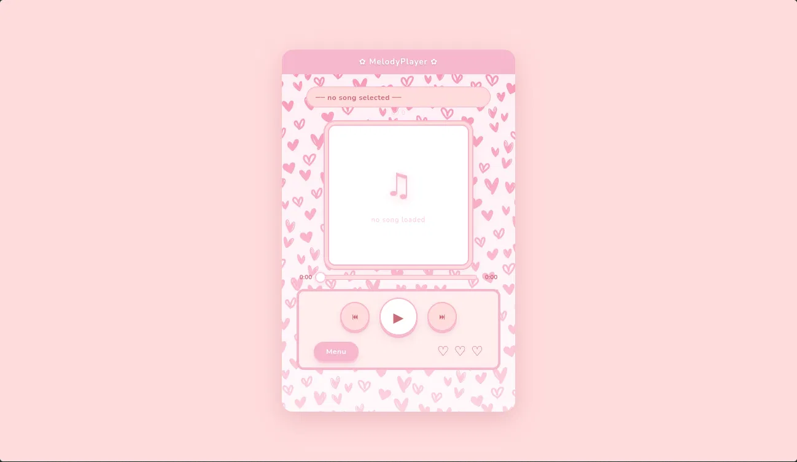
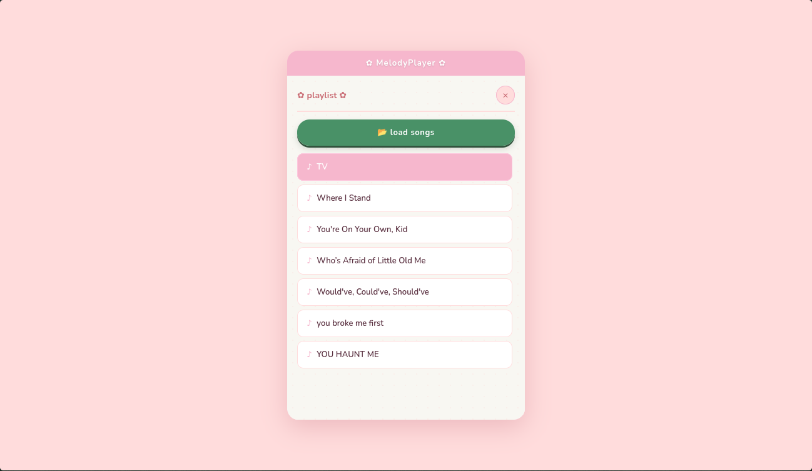
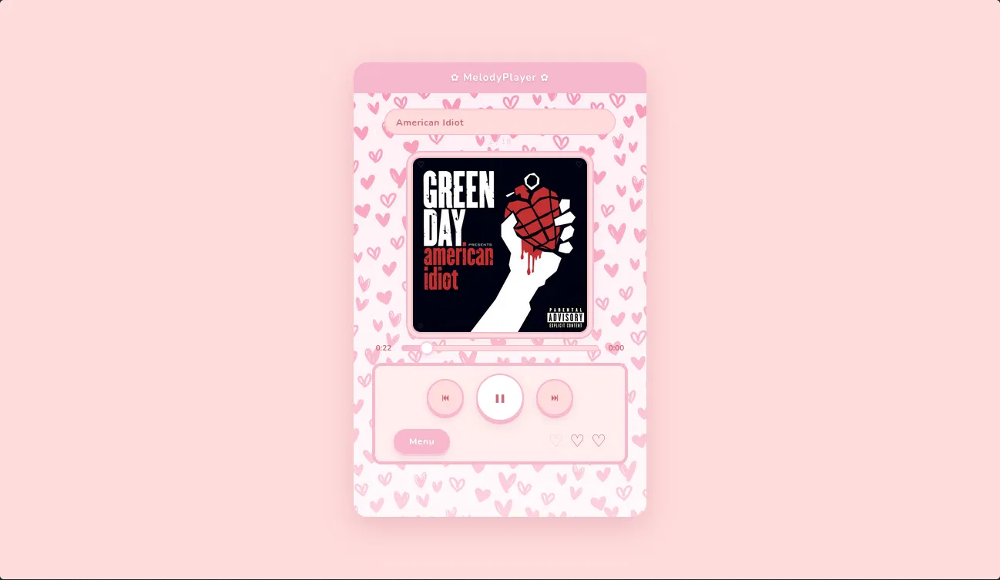

# ✿ MelodyPlayer ✿

A soft, aesthetic web-based music player with a pink scrapbook heart design. Works on both desktop and mobile no installation required.



&nbsp;

## Features

- **Local music playback** load your own songs directly from your device
- **Album art display** automatically reads embedded cover art from your audio files
- **Repeat modes** no repeat, repeat all, or repeat one, controlled via the heart buttons
- **Scrollable playlist** browse and jump to any song in your queue
- **Seekable progress bar** click or drag to scrub through tracks
- **Keyboard shortcuts** `Space` to play/pause, `←` `→` to navigate tracks

&nbsp;

## Screenshots

| Player                          | Playlist                                | Now Playing                           |
| ------------------------------- | --------------------------------------- | ------------------------------------- |
|  |  |  |

&nbsp;

## Getting Started

MelodyPlayer runs entirely in the browser no backend, no dependencies to install.

**Option 1: Use it live:**

👉 [melodyBee.github.io/melodyPlayer](https://melodyBee.github.io/melodyPlayer)

**Option: 2 Run it locally:**

```bash
git clone https://github.com/melodyBee/melodyPlayer.git
cd melodyPlayer
```

Then open `index.html` in your browser, or use a local server like [Live Server](https://marketplace.visualstudio.com/items?itemName=ritwickdey.LiveServer) for VS Code.

&nbsp;

## How to Use?

1. Open the player in your browser.
2. Tap **Menu** to open the playlist panel.
3. Tap **📂 load songs** and select your audio files.
4. Hit play and enjoy.

**Supported formats:** `.mp3` `.wav` `.ogg` `.flac` `.m4a` `.aac`

&nbsp;

## Repeat Modes

The three hearts at the bottom control playback repeat:

| Heart    | Mode                                |
| -------- | ----------------------------------- |
| ♡ first  | No repeat plays through and stops   |
| ♡ second | Repeat all loops the full playlist  |
| ♡ third  | Repeat one replays the current song |

The active mode is highlighted with light pink.

&nbsp;

## 📱 Install as an App (Android)

MelodyPlayer is a Progressive Web App (PWA). To install it on Android:

1. Open the live link in Chrome
2. Tap the three-dot menu
3. Select **Add to Home Screen**
4. It will appear as an app icon on your home screen ♡

&nbsp;

## 🛠️ Built With

- HTML, CSS, JavaScript no frameworks
- [music-metadata-browser](https://github.com/borewit/music-metadata-browser) for reading embedded album art
- Google Fonts Playfair Display & Nunito
- PWA manifest + service worker for offline support

&nbsp;

## 📁 Project Structure

```
melodyPlayer/
├── index.html
├── script.js
├── style.css
├── manifest.json
├── sw.js
└── assets/
    ├── icon.png
    └── bg.png
```

&nbsp;

## 👩‍💻 Author

Made with ♡ by [melodyBee](https://github.com/melodyBee)

&nbsp;

---

_feel free to star the repo if you like it_ ✿
